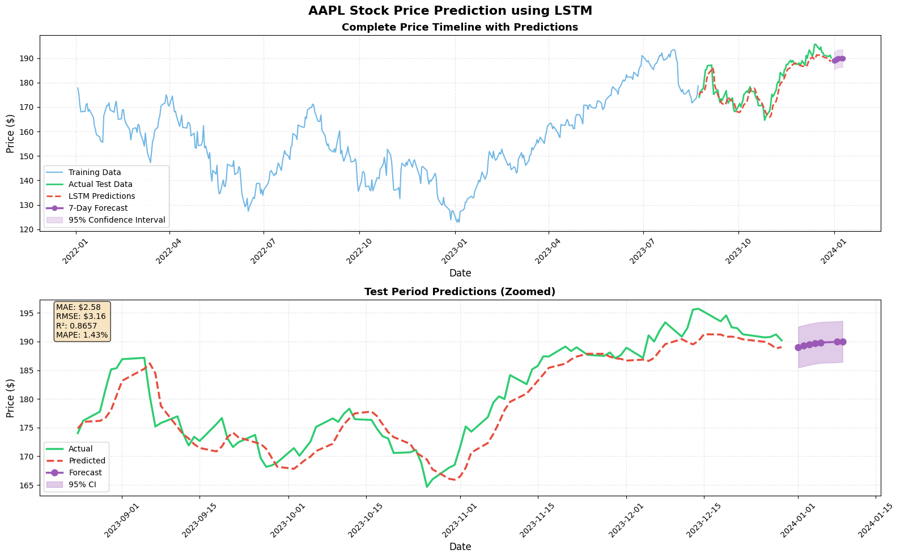

# LSTM Stock Price Prediction

A deep learning project that forecasts short term stock prices using a Long Short Term Memory (LSTM) network built in PyTorch. The model is trained on historical Apple (AAPL) stock data and predicts closing prices for the test period along with a 7 day future forecast.

## Overview

Stock prices are sequential in nature, and LSTM networks are well suited to capturing temporal dependencies in this kind of data. This project builds an end to end pipeline that downloads historical stock data, prepares it into sequences, trains an LSTM model, evaluates its performance, and generates future price forecasts with confidence intervals.

## Approach

The pipeline follows these steps:

1. **Data Collection**: Historical OHLCV (Open, High, Low, Close, Volume) data for AAPL is downloaded using the `yfinance` library, covering the period from January 2022 to January 2024.

2. **Data Preparation**: The five features are scaled to a range of 0 to 1 using `MinMaxScaler`. The scaled data is then converted into overlapping sequences of 60 days, where each sequence is used to predict the closing price of the following day.

3. **Train Test Split**: The sequences are split chronologically into 80 percent training data and 20 percent testing data, preserving the time order of the series.

4. **Model Architecture**: A 3 layer LSTM network processes each 60 day sequence. The final hidden state is passed through a dropout layer and two fully connected layers to produce a single predicted closing price.

5. **Training**: The model is trained for 100 epochs using the Adam optimizer and Mean Squared Error loss, with gradient clipping and a learning rate scheduler that reduces the rate on plateau.

6. **Evaluation**: Predictions on the test set are inverse transformed back to actual price values and compared against real closing prices using standard regression metrics.

7. **Forecasting**: The trained model performs an iterative 7 day forecast, where each predicted value is fed back into the input sequence to generate the next prediction. A 95 percent confidence interval is calculated from the test set prediction errors.

## Model Architecture

| Component | Configuration |
|---|---|
| Input features | Open, High, Low, Close, Volume |
| Sequence length | 60 days |
| LSTM layers | 3 |
| Hidden units | 128 |
| Dropout | 0.3 |
| Fully connected layers | 128 to 64 to 1 |
| Loss function | Mean Squared Error |
| Optimizer | Adam |
| Learning rate | 0.001 |
| Batch size | 32 |
| Epochs | 100 |

## Dataset

| Detail | Value |
|---|---|
| Ticker | AAPL (Apple Inc.) |
| Source | Yahoo Finance via yfinance |
| Date range | January 2022 to January 2024 |
| Total records | 501 trading days |
| Train and test split | 80 percent train, 20 percent test |

## Results

The model was evaluated on the held out test set with the following performance:

| Metric | Value |
|---|---|
| Mean Absolute Error (MAE) | $2.58 |
| Root Mean Squared Error (RMSE) | $3.16 |
| R² Score | 0.8657 |
| Mean Absolute Percentage Error (MAPE) | 1.43% |

An R² score above 0.86 combined with a MAPE under 1.5 percent indicates that the model captures the underlying price trend closely, with predictions typically staying within a few dollars of the actual closing price.

### 7 Day Forecast

Using the last known sequence from the test set, the model produced the following forward looking forecast, along with a 95 percent confidence interval:

| Day | Predicted Price | Change | 95% CI Lower | 95% CI Upper |
|---|---|---|---|---|
| 1 | $189.03 | -0.62% | $185.46 | $192.61 |
| 2 | $189.27 | -0.50% | $185.69 | $192.84 |
| 3 | $189.50 | -0.38% | $185.92 | $193.07 |
| 4 | $189.69 | -0.27% | $186.11 | $193.26 |
| 5 | $189.84 | -0.20% | $186.27 | $193.41 |
| 6 | $189.95 | -0.14% | $186.38 | $193.53 |
| 7 | $190.03 | -0.10% | $186.45 | $193.60 |

## Prediction Graphs

The chart below shows the complete price timeline including training data, actual test data, LSTM predictions, and the 7 day forecast with its confidence interval, followed by a zoomed in view of the test period.



The top panel shows the full historical timeline from training through the forecast horizon. The bottom panel zooms into the test period, comparing actual prices against model predictions, with the annotated metrics box showing MAE, RMSE, R², and MAPE.

## Project Structure

```
LSTM-Project/
├── Time series forecasting.ipynb   # Main notebook with the full pipeline
├── assets/
│   └── prediction_results.png      # Prediction visualization
└── README.md
```

## Requirements

- Python 3.8 or higher
- torch
- torchvision
- torchaudio
- pandas
- numpy
- matplotlib
- scikit-learn
- yfinance

Install dependencies with:

```bash
pip install torch torchvision torchaudio --index-url https://download.pytorch.org/whl/cu118
pip install pandas numpy matplotlib scikit-learn yfinance
```

## Usage

1. Clone the repository:
   ```bash
   git clone https://github.com/mandar-342/LSTM-Project.git
   cd LSTM-Project
   ```

2. Install the required dependencies listed above.

3. Open and run `Time series forecasting.ipynb` in Jupyter Notebook or Jupyter Lab.

4. The notebook will:
   - Download the latest AAPL stock data
   - Prepare and scale the data into sequences
   - Train the LSTM model
   - Evaluate performance on the test set
   - Generate a 7 day forecast
   - Produce the visualization shown above

## Key Components

- **StockDataset**: A PyTorch `Dataset` wrapper that converts sequences and targets into tensors for the data loader.
- **LSTMPredictor**: The neural network module defining the LSTM layers and fully connected output layers.
- **StockForecaster**: The main orchestration class that handles data preparation, training, prediction, iterative forecasting, and metric calculation.

## Limitations and Future Work

- The model is trained on a single ticker and a fixed two year window, so its performance may vary across different stocks, sectors, or market regimes.
- Iterative multi day forecasting compounds prediction error over the horizon, which is why the confidence interval widens with each additional day.
- The model currently relies only on price and volume history. Future improvements could include additional technical indicators, macroeconomic features, or sentiment data.
- Hyperparameter tuning, cross validation across multiple tickers, and comparison against baseline models such as ARIMA or Prophet would help validate the robustness of the results.

## Disclaimer

This project is intended for educational and research purposes only. The predictions generated by this model should not be used as financial advice or as the sole basis for any investment decision.
